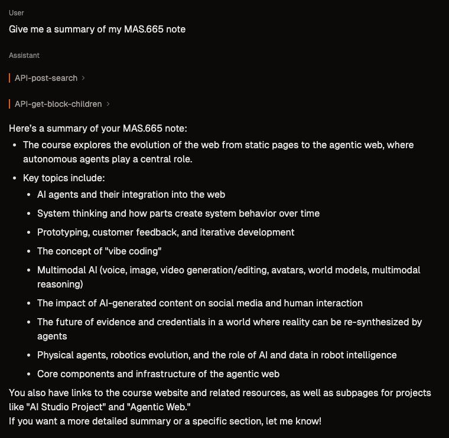
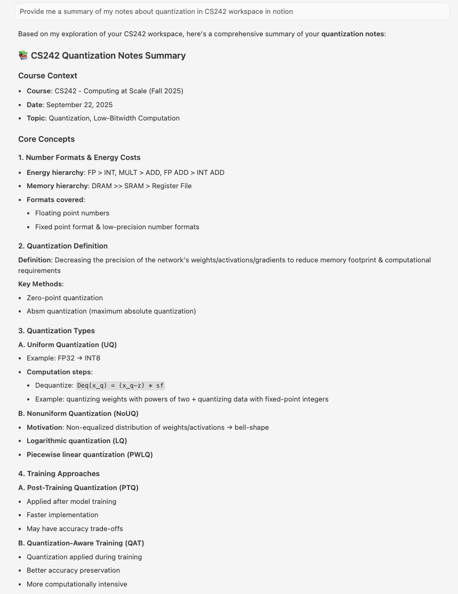

# Personal Notion MCP Server

[](https://smithery.ai/server/@Mingxiao300/notion-mcp-server-smithery)
A Model Context Protocol (MCP) server that connects AI assistants to my personal Notion workspace, specifically designed to access and query my study notes and lecture materials collected over the years.

## What This MCP Does

This MCP server provides AI assistants with direct access to my personal Notion workspace, which contains:

- **Lecture Notes**: Comprehensive notes from various courses including MAS.665 (Agentic Web), CS242 (Computing at Scale), and other technical subjects
- **Study Materials**: Personal research notes, quantization studies, AI/ML concepts, and technical documentation
- **Course Resources**: Organized knowledge base spanning multiple academic years

The server enables natural language queries against this knowledge base, allowing AI assistants to retrieve, summarize, and analyze my personal study materials in real-time.

## Backend Architecture

### Notion API Integration

The MCP server leverages the complete Notion API through the `notion-openapi.json` specification. Here are some example endpoints:

- **Search APIs**: `POST /v1/search` - Search across pages and databases by title
- **Page APIs**: `GET /v1/pages/{page_id}` - Retrieve specific page content and properties
- **Database APIs**: `POST /v1/databases/{database_id}/query` - Query structured databases with filters
- **Block APIs**: `GET /v1/blocks/{block_id}/children` - Access nested content and hierarchical structures
- **User APIs**: `GET /v1/users` - Retrieve user information and permissions

### Intelligent Routing

When users ask questions, the MCP server automatically:

1. **Analyzes the Query**: Determines the most appropriate Notion API endpoint
2. **Routes Requests**: Selects from search, page retrieval, database queries, or block content APIs
3. **Processes Results**: Formats and returns relevant information to the AI assistant
4. **Maintains Context**: Preserves conversation flow while accessing multiple knowledge sources

## Smithery Deployment

### Installing via Smithery

To install Personal Notion MCP automatically via [Smithery](https://smithery.ai/server/@Mingxiao300/notion-mcp-server-smithery):

```bash
npx -y @smithery/cli install @Mingxiao300/notion-mcp-server-smithery
```

This MCP server is configured for deployment on the Smithery platform using:

- **`smithery.yaml`**: Runtime configuration specifying TypeScript environment and registry settings
- **`src/index.ts`**: Main server entry point with configuration schema and MCP proxy initialization
- **Project Structure**: Organized codebase with OpenAPI integration, authentication handling, and transport layer management

The deployment leverages Smithery's cloud infrastructure for reliable, scalable access to the Notion workspace.

## Demo Usage

### Smithery Integration



In this demo, I query the MCP server directly through Smithery about my MAS.665 course notes. The system:
- Receives a request for a high-level summary of my course materials
- Automatically calls the appropriate Notion API endpoints
- Retrieves and synthesizes content from multiple pages
- Returns a comprehensive summary of the agentic web concepts, AI agents, and course topics

### Cursor Integration



This demonstration shows the MCP server integrated with Cursor IDE, where I ask about my CS242 quantization notes. The workflow:
- Connects to my personal Notion workspace through the MCP protocol
- Searches for quantization-related content in my study notes
- Retrieves detailed information about uniform quantization, energy costs, and computational techniques
- Provides structured summaries of complex technical concepts from my personal knowledge base


## Technical Implementation

Built on the foundation of the official Notion MCP server (see `README-notion-mcp.md` for detailed technical documentation), this implementation adds:

- Custom configuration for personal workspace access
- Optimized query routing for academic content
